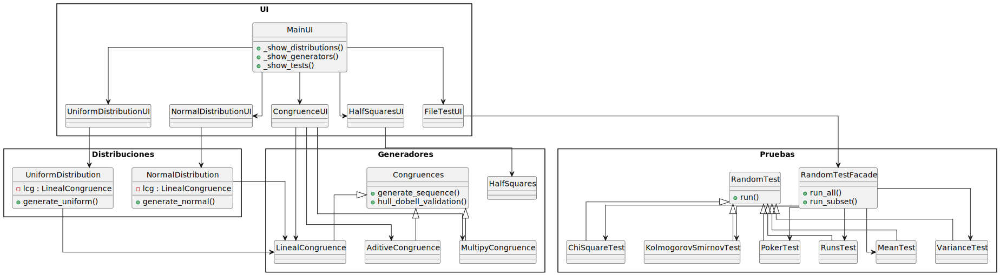

# Random Numbers Algorithms

Este proyecto implementa un sistema para generar números pseudoaleatorios usando los métodos de congruencias lineales, cuadrados medios y distribuciones (uniforme, normal), así como un conjunto de pruebas estadísticas para evaluar la aleatoriedad de las secuencias generadas.

## Project Structure

```
project/
│
├── main.py                     # Punto de entrada
├── generators/
│   ├── Congruences.py
│   ├── HalfSquares.py
│
├── distributions/
│   ├── Distributions.py
│
├── UI/
│   ├── MainUI.py               # Ventana principal
│   ├── UniformDistribution_UI.py
│   ├── NormalDistribution_UI.py
│   ├── Congruences_UI.py
│   ├── HalfSquares_UI.py
│   ├── FileTestUI.py
│   └── img/                    # Imágenes para la UI
│
├── tests/
│   ├── RandomTests.py
│
└── utils/
    ├── export_utils.py
```

## Requisitos

Antes de ejecutar el simulador, asegúrate de tener instalado, Python 3.8+ con las siguientes librerias

- matplotlib
- pandas
- numpy
- scipy
  que puede instalar con el siguiente comando

```
pip install matplotlib pandas numpy scipy
```

## Cómo correr el la app

En la consola de comandos

1. Clona el repositorio:

   ```bash
   git clone https://github.com/sunflowerjuan/random_numbers_algorithms
   ```

2. Ingresa al directorio del proyecto:

   ```bash
   cd random_numbers_algorithms
   ```

3. Ejecutar el archivo principal

   ```bash
   python main.py
   ```

4. En la interfaz grafica podras:

- Elegir un generador o distribución.

- Generar secuencias de números pseudoaleatorios.

- Ejecutar pruebas estadísticas sobre los números generados.

- Visualizar los resultados en tablas y gráficos.

- Exportar graficas y los datos generados.

## FUNCIONALIDADES

### Carga de parámetros desde archivo

El sistema permite cargar automáticamente parámetros de los generadores y distribuciones desde un archivo **CSV** o **TXT** con encabezados.

### Formato esperado del archivo

El archivo debe contener en la primera fila los nombres de los parámetros y en las siguientes los valores.  
Ejemplo de archivo `parametros.csv` para la distribucion Uniforme. El sistema solo cargara los parametros que coincidan con los estrictamente necesarios para el generador o distribucion :

```csv
Seed,n,a,b
7,100,0,1
13,50,10,20
```

Si existe mas de una fila de parametros, se abrirá un dialogo en donde podremos seleccionar la fila de parametros que deseemos. en la carpeta [params_examples](params_examples) hay una lista con ejemplos basicos de parametros para cada una de sus implementaciones

### Distribuciones

1. **NORMAL**

   - Permite generar números pseudoaleatorios con distribución normal usando el método de Box-Muller.

   - El usuario debe ingresar: media, desviación estándar, semilla (seed) y cantidad de números a generar.

   Muestra:

   - Tabla con los números generados (Ri y Ni).

   - Histograma de frecuencias de los números Ni.

   - Función de exportación para guardar la secuencia en un archivo.

2. **UNIFORME**

   - Genera números pseudoaleatorios con distribución uniforme en un rango [a, b].

   - El usuario debe ingresar: semilla, cantidad de números, límite inferior a y límite superior b.

   **Muestra**:

   - Tabla con los números generados (Ri y Ni).

   - Histograma de frecuencias de los números Ni.

   - Función de exportación para guardar la secuencia en un archivo.

### Generadores

1. **CONGRUENCIAS:**

   Permite generar números Ri usando distintos generadores congruenciales:

   - Lineal

   - Aditiva

   - Multiplicativa

   El usuario ingresa los parámetros correspondientes a cada tipo de generador (semilla, constante, multiplicador, módulo).

   **Muestra**: tabla de números generados y posibilidad de exportar resultados.

2. **CUADRADOS MEDIOS**

   - Genera números pseudoaleatorios usando el método de cuadrados medios.

   - El usuario ingresa la semilla y la cantidad de números.

   **Muestra**: tabla de números Ri y Ni truncados y calculados, además del periodo de repetición.

### Pruebas

- Ingrese un Archivo o secuencia manual

- Permite importar un archivo con números o escribirlos directamente.

**Ejecuta diversas pruebas estadísticas sobre la secuencia:**

1. Media – verifica si el promedio de la secuencia está dentro del intervalo esperado.

2. Varianza – evalúa si la dispersión cumple con la distribución uniforme.

3. Chi-cuadrado – compara frecuencias observadas vs esperadas (regla de Sturges).

4. Kolmogorov-Smirnov – prueba la uniformidad acumulada de la secuencia.

5. Poker – clasifica combinaciones de dígitos y evalúa la aleatoriedad.

6. Corridas (Runs) – analiza la sucesión de valores por encima o debajo de la mediana.

La fachada **RandomTestFacade** permite ejecutar todas las pruebas o solo un subconjunto elegido.

Devuelve resultados indicando si la secuencia **PASA** o **NO PASA** cada prueba, junto con estadísticas y valores críticos.

## Estructura del sistema y comunicación entre clases

### Interfaz de usuario (UI)

1.1. **MainUI**: Ventana principal que coordina todos los paneles.

1.2. **UniformDistributionUI / NormalDistributionUI / CongruenceUI / HalfSquaresUI / FileTestUI**: Paneles específicos para cada tipo de generador, distribución o prueba.

Cada panel interactúa con su clase de generador o distribución correspondiente.

### Generadores y distribuciones

2.1. **Congruences**: Clase abstracta para generadores congruenciales.

2.2. **LinealCongruence** / AditiveCongruence / MultipyCongruence: Heredan de Congruences y generan secuencias Ri.

2.3. **HalfSquares**: Generador por el método de cuadrados medios.

2.4. **UniformDistribution / NormalDistribution**: Transforman las secuencias Ri en números Ni con la distribución deseada.

### Pruebas estadísticas

3.1. **RandomTest**: Clase abstracta para todas las pruebas estadísticas.

3.2. **MeanTest, VarianceTest, ChiSquareTest, KolmogorovSmirnovTest, PokerTest, RunsTest**: Implementan cada prueba específica.

3.3 **RandomTestFacade**: Fachada que centraliza la ejecución de todas las pruebas.

### Flujo de comunicación

El usuario abre MainUI y selecciona una opción (Distribuciones, Generadores, Pruebas).

Se abre el panel correspondiente (por ejemplo, UniformDistributionUI).

El panel usa la clase de distribución o generador para producir números pseudoaleatorios.

Para pruebas estadísticas, FileTestUI utiliza RandomTestFacade, que invoca las pruebas correspondientes.

Los resultados se muestran en la interfaz gráfica y pueden ser exportados usando export_utils.py.

En el siguiente diagrama se ve las clases y sus relaciones



## License

This project is licensed under the MIT

```

```
